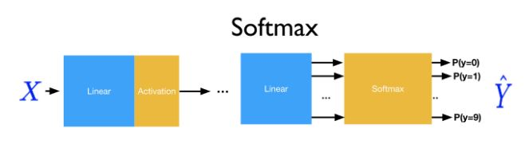

# Pytorch-Practice
Softmax classifier gives a slightly more intuitive output (normalized class probabilities) and also has a probabilistic interpretation. 
Such networks are commonly trained under a log loss (or cross-entropy) regime, giving a non-linear variant of multinomial logistic regression.
Here, we also classify MNIST classifier example. Mnist Dataset contains 0-9 character.  It is 10 label problem and to predict one out of 10 classes we transform our above Y to have 10 discreet values i.e 10 outputs. From probability distribution, we just take the maximum probable one. It is magic, it select one class which has maximum probability and forgets others.

